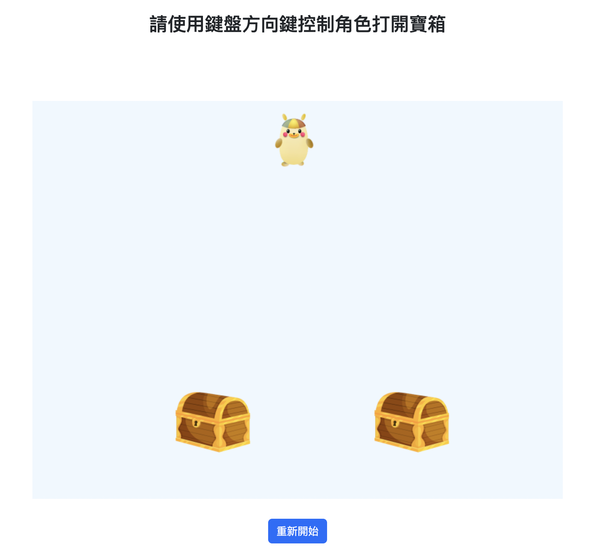

# HTML 寶箱遊戲

這是一個使用 HTML、CSS 和 JavaScript 構建的簡單的寶箱遊戲。玩家可以使用鍵盤方向鍵控制角色移動，並打開寶箱以獲取獎勵或觸發事件。
[網站連結](https://weiyann.github.io/direction/)

## 如何玩遊戲

使用鍵盤方向鍵控制角色的移動。
角色移動到寶箱附近時，寶箱會自動打開。
獲得美味起司時，你將得到獎勵，但小心觸發炸彈寶箱，否則你會被炸死！

## 遊戲控制

使用方向鍵：控制角色移動

## 如何重置遊戲

如果你想重新開始遊戲，只需點擊 "重新開始" 按鈕即可。

## 技術說明

這個遊戲是使用 HTML、CSS 和 JavaScript 構建的。它使用了 jQuery 和 bootstrap 來處理 DOM 操作和事件處理。通過修改 CSS 屬性來控制角色和寶箱的動畫，並使用 setTimeout 函数來實現動畫效果。

## 遊戲截圖

